# SVV Project

***

## Java SDK version: _17_
## Dependencies:

* _junit-4.13.2_
* _hamcrest-core-1.3_

## Plugins:

* _SpotBugs v1.2.5_

## Third party apps:

* _YourKit Java Profiler v2021.11-b220_

## Test coverage reports can be found at

[./testcoverage/index.html](./testcoverage)

## Or you can just check out this screenshot

## Static analysis

## Overall view:
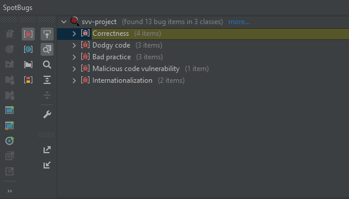

## Discovered bugs:

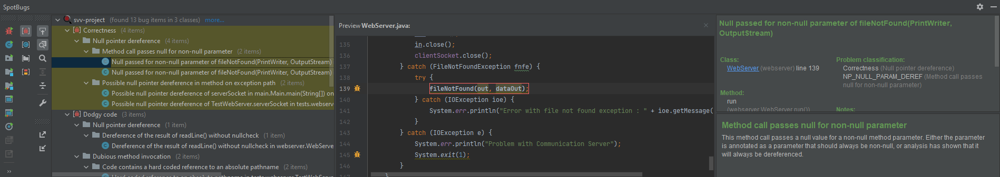

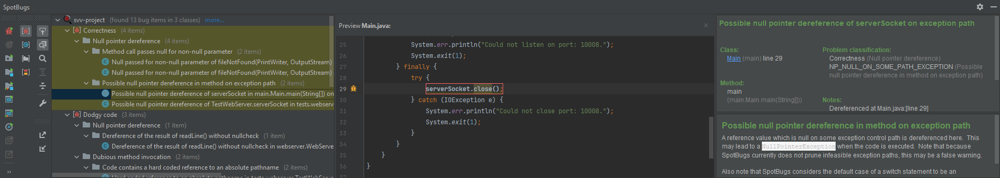

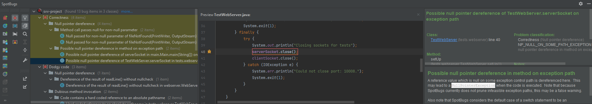

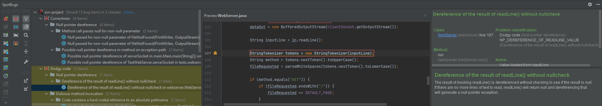

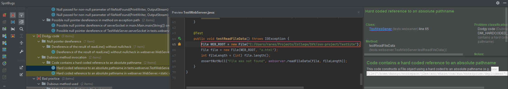

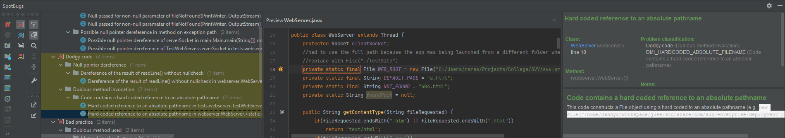

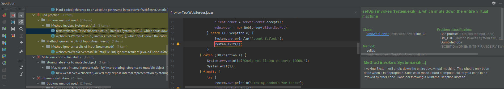

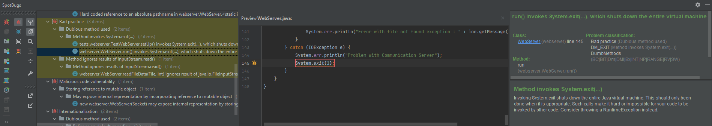

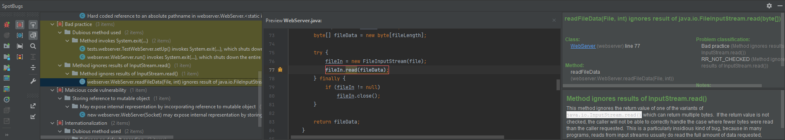

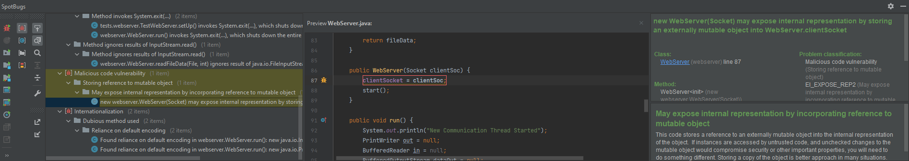

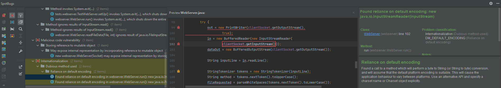

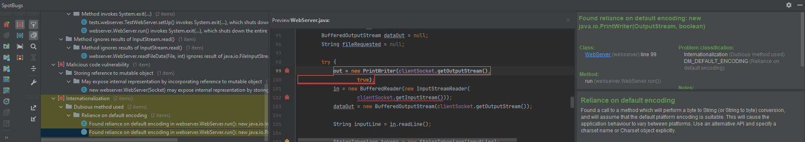

## Dynamic analysis

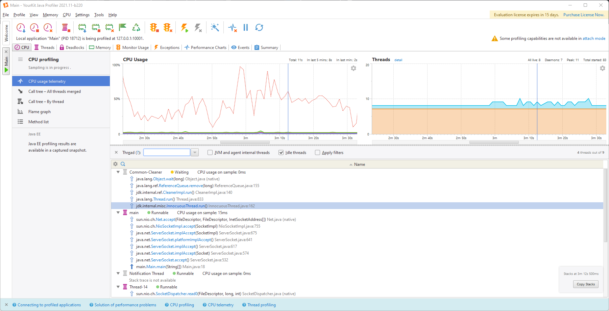

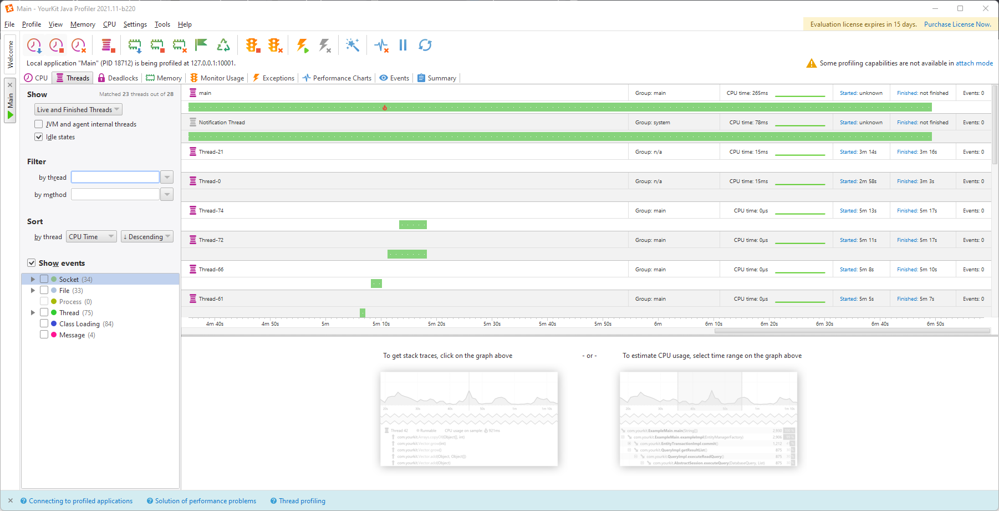

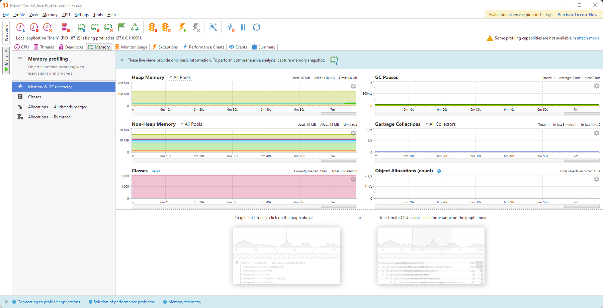

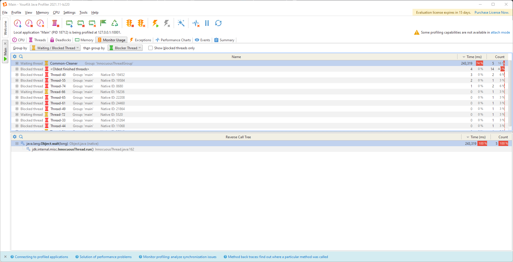